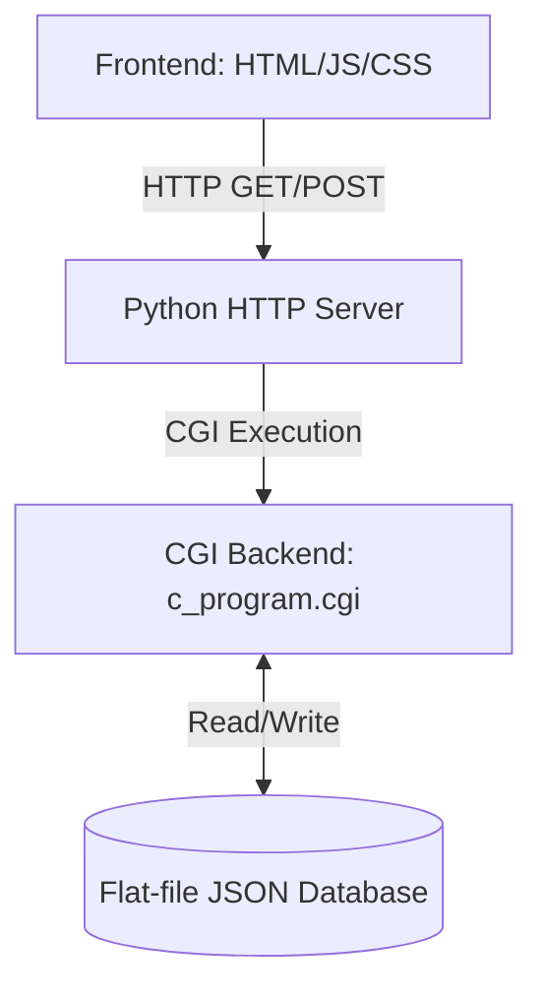

# BookiSH Library Management System: Architecture & Workflow

BookiSH is a lightweight, modern Library Management System designed to handle book inventory, student registrations, and borrowing workflows. 

## 1. High-Level Architecture

BookiSH follows a classic **Client-Server Architecture** utilizing a Common Gateway Interface (CGI) backend, allowing for a remarkably fast and lightweight footprint without the need for a heavy backend framework or SQL database engine.

### 1.1 The Technology Stack
- **Frontend**: Pure HTML5, JavaScript (Vanilla), and CSS. 
  - **Tailwind CSS** (via CDN) is used for utility-first styling.
  - **SweetAlert2** is used for modern popup notifications and alerts.
- **Web Server**: Python's built-in `http.server` running in CGI mode (`python -m http.server --cgi 8080`).
- **Backend / API**: A compiled C program (`server.c` -> `c_program.cgi`). C was chosen for extremely fast execution times and low memory overhead.
- **Database**: Flat-file JSON structure (`books.json`, `borrows.json`, `students.json`, `admins.json`). The C backend parses and mutates these JSON files dynamically to act as a lightweight database.

---

## 2. Flat-File Database Structure

Instead of using SQL, BookiSH stores all relational data in flat JSON files. The backend C script manually handles the extraction, modification, and saving of these records.

1. **`books.json`**: The core inventory. Each record represents a single physical book with unique identifiers (Book ID, ISBN) and metadata (Title, Author, Cover Image, Status).
2. **`students.json`**: Registered library members. Tracks Student ID, Name, Email, and Department.
3. **`borrows.json`**: Transactional ledger. When a book is borrowed, a record is written here linking the Book ID to the Student ID alongside timestamps (Borrow Date, Due Date, Return Date, Fine amount).
4. **`admins.json`**: High-privileged library staff credentials.

---

## 3. Core Workflows

The application behavior diverges significantly based on the **Role** assumed during login: **Admin** or **Student**.

### 3.1 Authentication Workflow
1. User navigates to `login.html` and selects their Role.
2. The frontend JavaScript (`login.js`) captures the credentials and sends a POST request to `/cgi-bin/c_program.cgi` with `action: 'login'` or `action: 'signup'`.
3. **Backend Validation**: 
   - For Admins, `server.c` parses `admins.json` and verifies the credentials.
   - For Students, it parses `students.json`.
4. On success, the frontend stores the role and identifiers in `localStorage` and redirects the user to their respective dashboard (`library.html` for Admins, `available.html` for Students).

### 3.2 The Student Workflow (Read-Only)
Students have restricted access designed purely for browsing and checking their own status.
- **Browse Catalog**: Students view `available.html`. The frontend fetches `books.json` via the CGI script and renders the grid. Students can filter by category or availability. 
- **No Direct Borrowing**: To prevent inventory tampering, students cannot click "Borrow" themselves. They must browse the catalog, find an available book, and request the Librarian (Admin) to process the physical checkout.

### 3.3 The Admin Workflow (Read & Write)
Admins have full CRUD (Create, Read, Update, Delete) access to the library's data.

> [!NOTE]
> **State Derivation**
> A book's `status` (Available vs Borrowed) is automatically derived based on whether an active record for that book exists inside `borrows.json`. 

- **Adding a Book**: Admin fills out the form on `add.html`. The frontend POSTs to the CGI script (`action: 'add'`). The C backend opens `books.json`, appends the new JSON object, and saves the file.
- **Borrowing a Book (Checkout)**: 
  1. Admin navigates to `borrow.html`.
  2. Admin enters the Book ID and the Student ID.
  3. The C backend first validates that the Student ID exists in `students.json`. If it does not, the transaction is rejected.
  4. A new active record is injected into `borrows.json`, and the specific book in `books.json` has its status mutated to `Borrowed`.
- **Returning a Book**:
  1. Admin navigates to `return.html` and searches for the Book ID.
  2. The frontend queries the active borrows to calculate any late fees.
  3. Admin confirms the return. The CGI backend (`action: 'return'`) modifies the record in `borrows.json` to mark it as `Returned` and reverts the book in `books.json` to `Available`.

---

## 4. Security & Performance Considerations

> [!WARNING]
> **Production Limitations**
> Because this project uses a flat-file JSON architecture and a basic CGI server, it is highly optimized for local or small-scale usage, but lacks robust concurrency controls (like database locking) for high-traffic, multi-user production environments.

- **Speed**: The combination of a lightweight Python router and a compiled C backend means API request processing times are nearly instantaneous compared to heavy Node.js or Python Django backends.
- **No-Database Setup**: By relying on standard JSON files, the software is fully portable. To back up the entire database, you only need to copy the 4 `.json` files.
